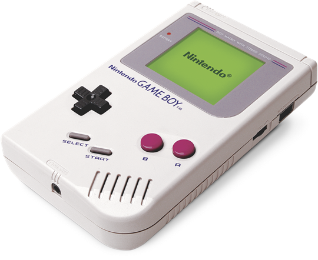
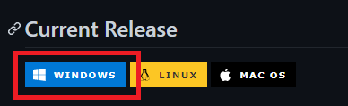
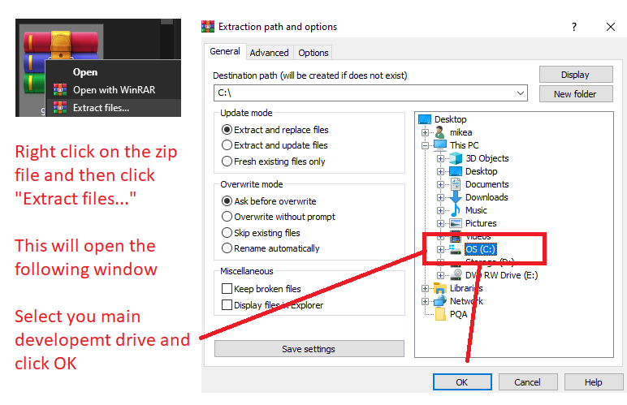
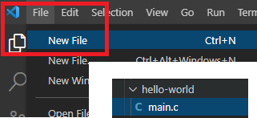
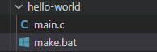
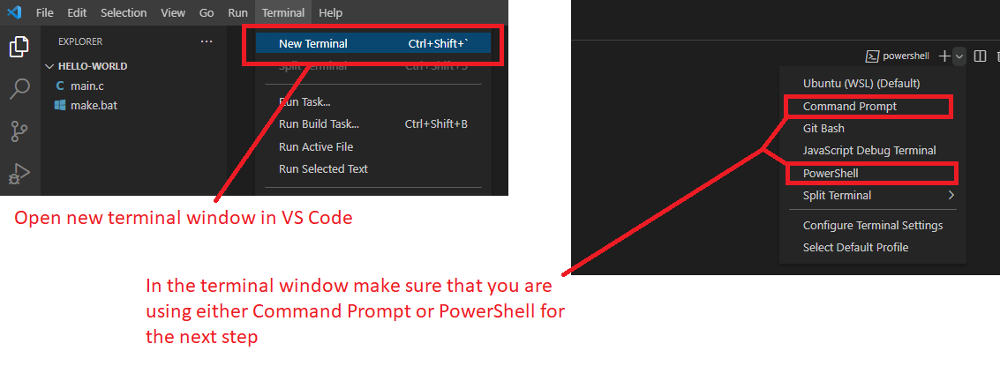
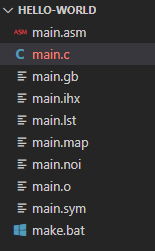
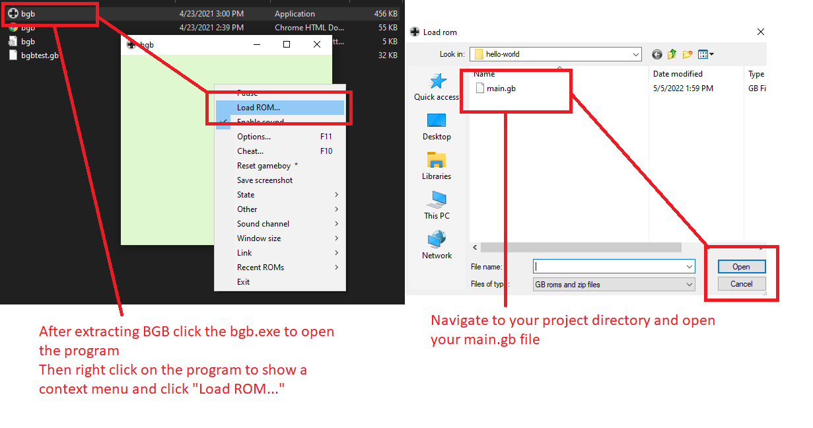
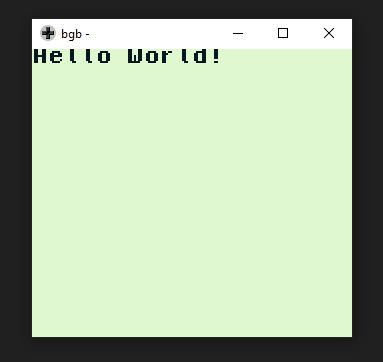

# Gameboy development quickstart guide

## The Nintendo Gameboy is a handheld console released by Nintendo in 1989
### This guide will provide the steps to get set up to develop games for the system on Windows in C
#

#
## 1. Software needed
#
For this guide you will need to have some software already installed.
1. Something to unzip a file<br>
I'm using winRar in the example<br>
https://www.win-rar.com/start.html?&L=0

2. Something to edit code<br>
Visual Studio Code will work<br>
https://code.visualstudio.com/download

3. An emulator to run your game<br>
BGB is a great emulator for development because it includes built in debugging features<br>
https://bgb.bircd.org/#downloads<br>

#
## 2. Setting up your environment
### GBDK
#
The best place to start is with downloading the GameBoy Development Kit (GDBK).
This software development kit (SDK) will give you all of the tools and libraries that you will need to get started, as well as some example projects.
* The most up to date version of GDBK can be found here:<br>
https://github.com/gbdk-2020/gbdk-2020<br><br>
* Start by downloading the .zip file for windows<br>
<br><BR>
* Once downloaded, extract to the root of your C:// drive<br><br>
<br><br>

#
## 3. First Project
### Hello World
#
Let's start off simple by creating a project that displays text on the screen.

### 3.1 First create a new C file and save it to your project directory.<br>
Here I've created a file titled "main.c" in my hello-world directory<br>
<br><br>

In that fille we will include the gdbk library. 
Add the following to the top of your "main.c"<br>
```
#include <gb/gb.h>
#include <stdio.h>
```
 Next let's create a simple main function to print our text<br>
```
void main() 
{
    printf("Hello World!");
}
```
### 3.2 At this point we also need to create a second file called "make.bat" in the same directory<br>
<br><br>

Add the following two lines of code to your make.bat file<br>

```
c:\gbdk\bin\lcc -Wa-l -Wl-m -Wl-j -DUSE_SFR_FOR_REG -c -o main.o main.c
c:\gbdk\bin\lcc -Wa-l -Wl-m -Wl-j -DUSE_SFR_FOR_REG -o main.gb main.o
```

Once these two files are set up we'll need to open a terminal in the project directory

<br><br>

In the terminal type the following command and press enter
```
.\make.bat
```
Running this command will create a multitude of files on your directory<br><br>
<br><br>
The most important file is "main.gb"<br>
This is the gameboy file that you will be able to run on either hardware or a gameboy emulator

#
## 4. Playing your game
### GDB
#
The final step is to load up your rom (main.gb) into an emulator

<br><br>

And there you have it, your first gameboy game!


